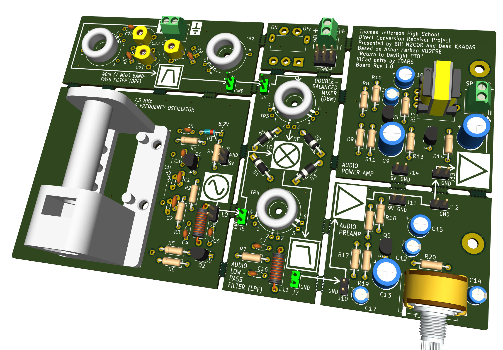
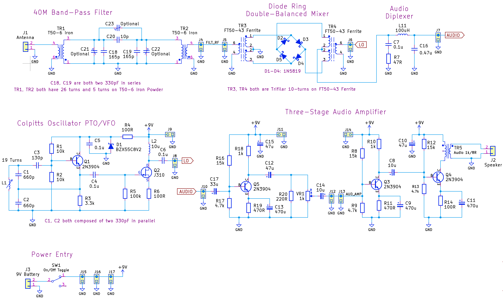
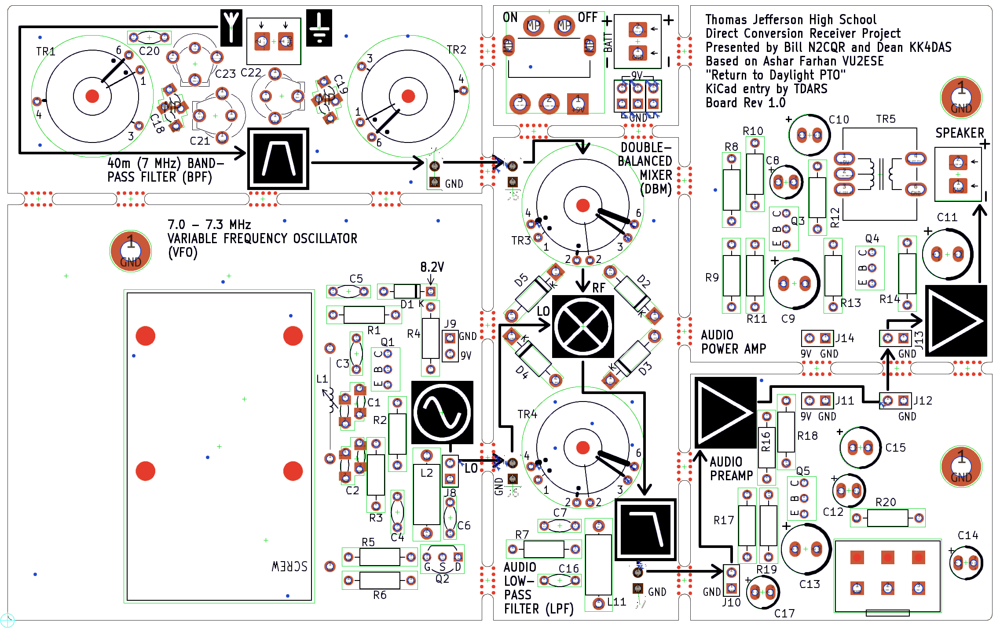
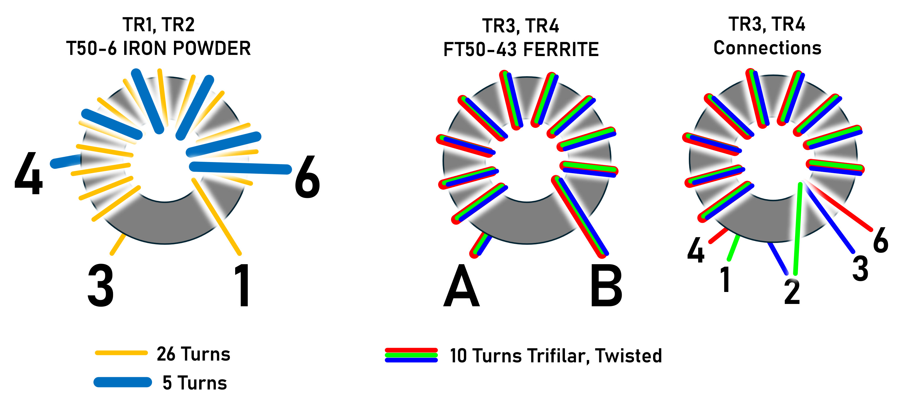

# Simple Direct Conversion Receiver for 40m (7 MHz) Band

This project is based on https://hackaday.io/project/190327/files

The main difference is that the project has been converted to a printed circuit board layout.

# Ordering

To order a PCB, [Click here for the PCB Gerber Zip File](https://github.com/shabaz123/simple_dcr/blob/main/gerber-export-dcr-pcbver-rev1_0.zip) and then upload it to any PCB manufacturer. The board is 2-layer, 160 x 100 mm in size.

The parts list is in a table further below.

# Circuit Diagram

[Click here for the PDF version](https://github.com/shabaz123/simple_dcr/blob/main/dcr-schematic-rev1_0.pdf)

# Board Layout

# Toroid Detail

## TR1, TR2

T50-6 Iron Powder

Pins 1-2: 26 Turns

Pins 6-4: 5 Turns

## TR3, TR4:

FT50-43 Ferrite

10 Turns Trifilar

Three Windings: Red, Green, Blue

Pin 4: Red end A

Pin 6: Red end B

Pin 1: Green end A

Pin 3: Blue end B

Pin 2: Remaining ends (Green end B, Blue end A)

# Parts List

**Reference**|**Value**|**Qty**|**Description**
-----|-----|-----|-----
C1,C2|2 x 330pF in Parallel|4|NP0 Ceramic Capacitors (660pF combined)
C3|130p|1|NP0 Ceramic Capacitor
C4,C5,C6,C7|0.1u|4|Ceramic Capacitor
C8,C14|10u|2|Electrolytic Capacitor
C9,C11,C13|470u|3|Electrolytic Capacitor
C10,C12,C15|47u|2|Electrolytic Capacitor
C16|0.47u|1|Ceramic Capacitor
C17|33u|1|Electrolytic Capacitor
C18,C19|2 x 330pF in Series|4|NP0 Ceramic Capacitors (165pF combined)
C20|10p|1|NP0 Ceramic Capacitor
C21,C22,C23|Optional|3|40pF Trimmer Capacitors
D1|BZX55C8V2|1|Zener Diode 8.2V
D2,D3,D4,D5|1N5819|4|Schottky Diode
J1|Antenna|1|3.5mm or 3.8mm 2-way Screw Terminal Block
J2|Speaker|1|8 ohm Speaker
J3|9V Battery|1|PP3 Battery Connector
L1|Variable Inductor|1|19 Turns on 3D-printed Former
L2|10u|1|Axial Inductor
L11|100uH|1|Axial Inductor
Q1,Q3,Q4,Q5|2N3904|4|NPN Transistor
Q2|J310|1|N-ch JFET
R1,R2|10k|2|Resistor
R3|3.3k|1|Resistor
R4,R6,R14|100R|3|Resistor
R5|100k|1|Resistor
R7|47R|1|Resistor
R8,R12,R16|15k|3|Resistor
R9,R13,R17|4.7k|3|Resistor
R10,R18|1k|2|Resistor
R11,R19|470R|2|Resistor
R20|220R|1|Resistor
SW1|SPDT|1|Right-Angle SPDT Toggle Switch
TR1,TR2|T50-6|2|Toroid Iron Powder Type 6
TR3,TR4|FT50-43 Ferrite|2|Toroid Ferrite Type 43
TR5|Transformer 1k/8R|1|Audio Transformer 1kohm:8ohm
VR1|1k|1|Potentiometer Log Audio (Type A)

